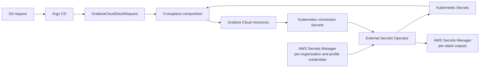

# Architecture

There are four separate ownership layers:

1. **Argo CD** owns controller installation, platform definitions, environment configuration, and
   request objects stored in Git.
2. **Crossplane** owns the composed Kubernetes managed resources and continuously reconciles
   their external Grafana objects.
3. **External Secrets Operator (ESO)** owns materialization of secret inputs and publication of
   generated secret outputs.
4. **Grafana Cloud** remains the external system of record, observed and corrected by the Grafana
   provider.

**Argo CD must not also declare the managed resources emitted by the Composition.** That would
give two controllers ownership of the same Kubernetes objects. This is why
`application.resourceTrackingMethod: annotation` and the Crossplane-aware health customizations
in `deploy/argocd/argocd-values.yaml` matter — see [Installation](installation.md).
## What is in the repository

~~~text
.
├── platform/
│   ├── apis/                 XRDs and pipeline Compositions
│   ├── function/             Go composition function, tests, package metadata
│   ├── provider/             Grafana provider, activation policy, signature gate
│   ├── rbac/                 minimum extra composition RBAC for ESO resources
│   └── kustomization.yaml
├── examples/
│   ├── README.md             catalog index and safe enablement workflow
│   └── catalog/              inert stack, SSO, Teams, RBAC, and content-ACL examples
├── enabled/                  only path watched by the example ApplicationSet; empty by default
├── deploy/
│   ├── argocd/               controller, platform, and per-request GitOps examples
│   ├── aws/                  SecretStore, ExternalSecrets, ProviderConfig, IAM policy
│   ├── crossplane/           production-oriented Helm values
│   └── external-secrets/     production-oriented Helm values
├── scripts/                  validation and public-release safety scan
└── .github/workflows/        validation and signed multi-platform function publishing
~~~

The core product is platform/. Everything under deploy/ is an example integration layer and may be replaced with the equivalent tooling used by your organization.

## The vending API

The primary API is `GrafanaCloudStackRequest`. It is namespaced so teams or environments can be
separated with Kubernetes namespaces and RBAC. It supports Grafana Cloud only. A stack has one
immutable `spec.organization`, but one installation can serve several registered organizations.
Three access APIs and seven specialist APIs sit beside it; see [Request Schema Reference](reference/request-schema.md)
for each field, activation boundary, and limitation.

The XRD uses `defaultCompositionUpdatePolicy: Automatic` and an `enforcedCompositionRef`.
Existing requests therefore move to the latest Composition revision automatically after a
platform update. Treat an XRD or function change like a production API release: render it,
inspect the desired-resource diff, and roll it through a non-production request first.

The platform-owned `GrafanaVendingConfig` input holds a registry keyed by organization name. Each
entry supplies the organization ProviderConfig name plus permitted regions and usages. An unknown
organization, region, or usage fails closed; there is no single-organization fallback. Every
organization-plane child uses that name in the request namespace. Because v2 ProviderConfigs are
namespaced, every namespace that accepts requests must carry a same-named credential Secret and
ProviderConfig for each registry entry. Generated documents use
`{outputSecretPrefix}/{organization}/{usage}/{slug}`, enabling IAM scoping by organization.
`spec.lifecycle.externalResources` defaults to `Retain`. `Delete` is accepted only for an exact
request namespace/name/UID/profile tuple listed in `deletionAuthorizations`, which is empty by
default.

## How a request becomes managed resources

Each public kind is backed by a single-step Crossplane `Composition` in `Pipeline` mode that calls
the `function-grafana-vending` composition function (a Go program built from
`platform/function/`). The function reads the request spec plus the platform-owned
`GrafanaVendingConfig` Composition input and renders the complete set of desired Kubernetes
managed resources — there is no templating language involved, the rendering logic is Go code
covered by `platform/function/fn_test.go`.

## Composition model, renderer registry, and resource graph

The composition function is the renderer registry for this API. Each public composite kind has a
single registered renderer that receives the request, the observed composed resources, and the
platform-owned `GrafanaVendingConfig`. Renderers add only the managed resources owned by that
kind, preserve stable names and external identities, and return the complete desired set to
Crossplane. There is no second templating engine or hand-maintained per-request manifest.

The resource graph starts at the namespaced request or explicit module object and follows the
selected stack `ProviderConfig` into Grafana Cloud. Parent resources gate children when Grafana
must first assign an external ID: the rotating administrator token follows the service account,
the telemetry token follows its access policy, and module-specific children follow their observed
stack, datasource, collection, or installation prerequisites. ESO carries credential material
between the Kubernetes connection Secrets and the external secret store; it is not part of the
Grafana resource ownership graph.

The activation policy is an allow-list for the provider kinds emitted by the registry. Adding a
new renderer therefore requires the corresponding XRD, Composition, provider activation entry,
and focused desired-resource tests to move together. Observe-only inventory kinds are enabled only
for inventory renderers and never become mutating children.

Five XRDs add cluster-scoped admission before reconciliation: cloud integrations, k6, ML, PDC, and
service accounts. Each ships an `admissionregistration.k8s.io/v1` `ValidatingAdmissionPolicy` and
binding whose `paramRef` names that XRD's Composition. This makes Kubernetes 1.30 the platform
floor. The Composition carries platform limits that admission evaluates against the submitted
object. Each binding sets `parameterNotFoundAction: Deny`, so removing or renaming the Composition
closes that surface at admission instead of silently bypassing its policy. Operators see a denied
request attributed to the named policy until the XRD and its original Composition are installed
together again.

## Reconciliation and out-of-band changes

Crossplane providers poll the external APIs and compare observed state with desired state. The
exact delay is the provider poll interval plus API and controller latency — it is not an
immediate webhook response.

The short answer is: an administrator's SSO edit is automatically repaired only when SSO mode is
enforced.

An administrator's out-of-band change (through the Grafana UI, say) is repaired only when the
affected field's reconciliation mode says so:

| Resource or field | Mode | Effect of an out-of-band edit |
| --- | --- | --- |
| Stack name, region, labels, readiness flags | managed `forProvider` fields | Crossplane attempts to restore the value in the request |
| Stack deletion | `spec.lifecycle.externalResources: Retain` (default) | Normal request pruning orphans external resources and leaves the Stack protected |
| Armed external deletion | `spec.lifecycle.externalResources: Delete` with an exact platform authorization | After `status.deletionReady=true`, three reviewed stages clear access claims, wait for their finalizers to disappear, and then remove the request; only state that can outlive the Stack is deleted |
| Baseline dashboard JSON | `createOnly` | Initial JSON is supplied through `initProvider`; later UI edits are preserved |
| Baseline dashboard JSON | `enforced` | UI edits are detected and restored from Git-rendered desired state |
| Folder title and dashboard folder relationship | managed `forProvider` fields | Drift is restored even when dashboard JSON is create-only |
| Home dashboard UID | `createOnly` | Initial choice is set; a later administrator change is preserved |
| Home dashboard UID | `enforced` | A later administrator change is restored |
| SSO settings | `enforced` | Crossplane owns OAuth/SAML settings and repairs UI drift |
| SSO settings | `createOnly` | Crossplane initializes settings but does not own later changes |
| SSO settings | `observeOnly` | Crossplane observes the named provider and never creates or updates it |
| SSO settings | `disabled` | No SSO managed resource is desired |
| Plugins | listed | Crossplane reconciles listed installations; omitted plugins are not adopted |
| Custom roles, assignments, team sync | present in a binding | Crossplane repairs drift in the managed fields |
| Team direct members and preferences | present in `GrafanaTeamAccess` | Crossplane restores the declared direct members and preferences; external sync members are ignored when configured |
| Fixed/custom `RoleAssignmentItem` | present in `GrafanaTeamAccess` | Crossplane restores the role-to-team assignment without owning other actors assigned to that role |
| Folder or dashboard ACL | present in `GrafanaContentAccessPolicy` | Crossplane restores the complete declared ACL; omitted entries are removed by Grafana's whole-set permission API |
| OnCall outgoing-webhook data | `createOnly` | Initial generic payload is set; later UI template edits are preserved |
| OnCall outgoing-webhook data | `enforced` | Later UI template edits are restored from the Composition |
| Alerting contact-point payload | enabled | Crossplane always restores the relay payload and Secret-backed authorization contract |
| Alerting bundle | `enforced` or `createOnly` provenance | Enforced locks UI edits; create-only seeds values and preserves later UI edits |
| Assistant governance | observed terms acceptance | Rules/MCP servers wait for acceptance and are pruned on withdrawal |
| Datasource access | declared whole permission/LBAC set | Omitted managed non-inherited Query grants are removed; other grants remain additive |
| Product singleton | activation toggle enabled | Removing the composed child does not request external Delete under the standard policy |

Changing SSO from `enforced` to `createOnly` moves `oauth2Settings`/`samlSettings` from
`forProvider` to `initProvider` while retaining a stable external name for the provider — the
supported handoff from platform ownership to administrator ownership. `observeOnly` removes write
authority. `disabled` removes the managed-resource object from the Composition; under the
retain-by-default lifecycle, the external SSO configuration remains but is no longer observed. Changing the
identity type itself (e.g. `generic_oauth` to `saml`) is an identity-provider migration, not a
routine mode toggle — plan a tested login and rollback path.

Argo CD should ignore Crossplane-generated resource churn rather than carrying broad ignore rules
for the request itself. If the request in Git changes, Argo CD applies the request; the
Composition then computes the resulting managed-resource change.

## Decommission and access-claim ordering

Arming deletion and removing a request are separate reviewed stages. The first changes the request
lifecycle to `Delete`; it does not delete anything. Wait for `status.deletionArmed=true` and then
`status.deletionReady=true`, where readiness means observed provider state reports the Stack's
`deleteProtection=false` and ESO has finalized and successfully synced each enabled credential
document at its current generation. Stage 2 removes dependent `GrafanaCustomRoleBinding`, `GrafanaTeamAccess`,
and `GrafanaContentAccessPolicy` objects. Merge or sync that change and wait until their Kubernetes
objects and finalizers are gone while the Stack and request still exist. Stage 3 removes the request
from Git only after that check passes, so the stack endpoint does not
disappear before the access claims clear.

New access claims fail closed as soon as deletion is armed or the stack request is terminating.
Already-observed access children remain desired until their claims are deliberately removed in Stage 2.

Armed Delete covers the Stack, its administrator service account/token, the telemetry access
policy/token, and administrator/telemetry `PushSecret` documents. Stack-local Grafana content stays
retain/orphan because Stack deletion destroys it. AWS Secrets Manager uses a 30-day recovery window
by default for deleted `PushSecret` documents; the supplied IAM policy permits `DeleteSecret` only
for output documents carrying the function's stable `grafana-cloud-vending-machine: managed`
tag. Other backends must be checked for `PushSecret` Delete support. See the
[decommission runbook](governance.md#decommission-runbook)
for the complete sequence.

## Baseline and optional resources

The baseline creates three portable starting points occupying the same resource slots as a
traditional billing/usage, endpoints, and home-dashboard bundle. They are intentionally simple
and generic; no source-specific dashboard JSON is copied or implied. Keep service-owned
dashboards outside the stack identity API so an ordinary content release cannot disturb stack
identity or credentials.

- Billing and usage
- Telemetry endpoints
- Stack home

The baseline stays intentionally small. Opt-in modules now cover observe-only stack inventory,
Fleet pipeline profiles, alerting bundles, Agent Observability, Assistant governance, datasource
access, Git provisioning repositories, and product activation toggles. Their configuration does
not become stack-baseline content: workload policy, connection secrets, entitlement, plugin, and
Git-credential prerequisites stay outside ordinary stack vending. Adaptive Metrics, Logs, Traces,
and Profiles are deliberately out of scope; use their UI and ticket-based routes. See the
provider-family table in the project
[provider-family table](#complete-provider-surface-and-ownership-boundaries)
for the complete ownership map across all 121 managed-resource kinds the provider exposes.

## Complete provider surface and ownership boundaries

The pinned provider exposes 121 namespaced external managed-resource kinds across 17 Grafana API families, plus 50 observe-only kinds generated from Terraform data sources. Comprehensive architecture means assigning every family a sensible owner; it does not mean every new stack should automatically create an SLO, a k6 project, an incident schedule, an ML job, and organization members.

The activation policy enables only kinds emitted by the current Compositions. Add a kind deliberately when adding a domain API.

| Provider family | Treatment in this reference |
| --- | --- |
| agento11y | `GrafanaAgentObservability` activates the family only from explicit `guards` and `workload` sections. Guards own HookRule/RuleAction; workload owners define Collection/Evaluator/EvaluationRule. Plugin availability and credentials remain environment prerequisites. |
| alerting | Core retains optional incident-relay ContactPoints. `GrafanaAlertingBundle` owns RuleGroup, ContactPoint, MuteTiming, MessageTemplate, and InhibitionRuleV1Beta1 with explicit provenance and per-rule routing; it never renders the destructive organization-wide NotificationPolicy/Routingtree singleton. |
| asserts | Use a separate opt-in onboarding module because entitlement and additional metrics/Grafana credentials are required. |
| assistant | `GrafanaAssistantGovernance` terms-gates platform-selected Rules and MCPServers. Restrictive `always_ask` is the default; headers are write-only Secret data. |
| cloud | Core owns Stack, StackServiceAccount, StackServiceAccountRotatingToken, AccessPolicy, AccessPolicyRotatingToken, optional PluginInstallation, and the three product global singletons selected by `spec.products`. Product configuration is not part of the stack request. |
| cloudintegrations | CloudIntegration belongs in an integration module selected after stack creation. |
| cloudprovider | AWS scrape jobs/accounts and Azure credentials require separate cloud trust and approval. |
| connections | Metrics endpoint scrape jobs are workload-owned connection objects. |
| enterprise | Core optionally owns Report; access APIs own Role, RoleAssignment, and RoleAssignmentItem. `GrafanaDatasourceAccess` owns one DataSource, its whole permission set, and aggregated LBAC tree. Team Sync external-group mapping is supported. SCIM is explicitly rejected because its Team ownership conflicts with that model; Keeper remains separate. |
| fleetmanagement | `GrafanaFleetPipelines` selects a platform-owned pipeline baseline and publishes a Fleet credential chain. Collectors self-register; usage groups remain UI-only and Advanced-tier. |
| frontendobservability | Applications require workload identity and origin inputs unavailable at stack creation. |
| grafana | Namespaced ProviderConfig is created per stack. ClusterProviderConfig is avoided to preserve namespace isolation. |
| k6 | `GrafanaK6Project` owns bounded projects, limits and allowed load zones through a derived credential. Tests, schedules and private-zone provisioning remain consuming-team responsibilities. |
| ml | Alerts, holidays, jobs, and outlier detectors depend on real queries and service ownership. |
| oncall | Core optionally creates relay-backed OutgoingWebhook resources. Users, routes, schedules, shifts, integrations, and escalation policy belong in an incident-management module. |
| observe-only inventory | `GrafanaStackInventory` activates only provider data sources and classifies declared, managed, and unmanaged folders, dashboards, teams, users, library panels, probes, collectors, and selected organization users. It never renders a mutating child. |
| oss | Core owns Folder, Dashboard, OrganizationPreferences, and SsoSettings; access APIs own Team, FolderPermission, and DashboardPermission. `GrafanaProvisioningRepository` is an opt-in preview Git subtree route referencing an existing Connection. Inventory observes folders, dashboards, teams, users, and library panels; playlists, annotations, and additional service accounts remain separate. |
| slo | Platform usage profiles vend a ratio golden SLO in handoff mode after datasource observation. Workload metrics and objectives remain explicitly supplied. |
| sm | `GrafanaSyntheticMonitoring` exchanges a bootstrap credential, independently verifies a disabled Check, and constrains team-authored checks by platform budgets. Private probes and their tokens remain outside this API. |

This leads to a clean GitOps tree:

~~~text
platform Application
  providers, functions, activation policy, XRDs, Compositions, secret stores

stack-request Applications
  one GrafanaCloudStackRequest
  zero or more GrafanaCustomRoleBinding objects

optional domain Applications
  stack content, inventory, and permissions
  alerting, Fleet, Assistant, and Agent Observability
  datasource access or Git provisioning repositories
  cloud integrations and connections
  incident management
  Synthetic Monitoring and SLOs
  application, database, Kubernetes, and frontend observability
  Fleet Management, k6, ML, Asserts, and Assistant
~~~

## Terraform vending-machine equivalence

This matrix was checked resource-by-resource against the active modules in the Terraform source used to design this reference. Commented-out examples and surrounding pipeline/cloud infrastructure are not counted as active stack behavior. Product-specific dashboard JSON, identity endpoints, external-system payloads, and secret paths are intentionally represented by neutral extension points rather than copied content.

| Terraform vending concern | Crossplane equivalent | Parity |
| --- | --- | --- |
| Cloud stack resource | Stack composed from GrafanaCloudStackRequest | Equivalent, continuously observed |
| Stack name, slug, region, usage, labels | Request fields and Stack labels | Equivalent |
| Stack readiness wait and first-create delay | waitForReadiness plus observed-ID gates and references | Equivalent outcome without a fixed sleep or two-pass apply |
| Deletion protection | `Retain` by default; explicit `Delete` only for an exactly authorized request identity and immutable profile | Equivalent with a stronger default and a reviewable decommission path |
| Administrator service account | StackServiceAccount | Equivalent |
| Static administrator token | StackServiceAccountRotatingToken | Superset through automatic rotation |
| Stack-local provider | ESO-built credentials plus namespaced ProviderConfig | Equivalent without credentials in code or state |
| External credential document | PushSecret document containing name, slug, URL, region, immutable organization/usage, request references, token, and `{outputSecretPrefix}/{organization}/{usage}/{slug}/telemetry-publisher` | Field parity through a backend-neutral secret manager |
| Telemetry publisher | Stack-realm AccessPolicy, rotating token, separate output | Superset through least privilege |
| Plugins | PluginInstallation list | Equivalent provider support |
| Billing/usage, endpoints, and home folders/dashboards | Three Folder and Dashboard pairs | Resource and lifecycle parity; neutral starter JSON replaces source-specific content |
| Ignore dashboard JSON changes | initProvider configJson in createOnly mode | Equivalent |
| Enforce dashboard JSON | forProvider configJson in enforced mode | Additional explicit option |
| Organization home dashboard | OrganizationPreferences | Equivalent, create-only or enforced |
| Monthly billing/usage report | Report with prior-month range, PDF/CSV, recipients, reply-to, and spread schedule | Equivalent; deterministic scheduling replaces random state |
| Code-owned OAuth SSO | SsoSettings enforced mode | Equivalent; UI drift is repaired |
| Administrator-owned OAuth SSO | createOnly, observeOnly, or disabled | More explicit than blanket ignore rules |
| OAuth alternatives and SAML | Platform-owned profile catalog | Additional Azure AD and SAML examples; GitHub, GitLab, Google, Okta, and generic OAuth are supported |
| Directory-synchronized teams | GrafanaCustomRoleBinding to Team | Equivalent |
| Custom roles and permissions | GrafanaCustomRoleBinding to Role | Equivalent |
| Role assignment | GrafanaCustomRoleBinding to RoleAssignment | Equivalent |
| Direct members, administrators, team preferences, multiple custom roles | GrafanaTeamAccess | Additional reusable access pattern |
| Existing fixed-role assignment | GrafanaTeamAccess to RoleAssignmentItem | Additional least-privilege pattern |
| Basic-role and Team folder/dashboard ACLs | GrafanaContentAccessPolicy | Additional authoritative content-access pattern |
| Incident outgoing webhooks | Four optional OutgoingWebhook resources with create-only or enforced data templates | Structural and reconciliation parity through a generic relay |
| Alert contact points | Two optional ContactPoint resources | Structural parity through a generic relay |
| Random report scheduling state | Deterministic FNV-derived UTC slot | Stateless replacement |
| Initial-creation feature gate | Observed-resource dependency gates | Architectural replacement; no manual second phase |
| Per-stack directory vending | Argo CD ApplicationSet over enabled directories | Equivalent GitOps request boundary |
| Plan/apply pipeline | Argo self-heal plus Crossplane reconciliation | Continuously reconciled replacement |
| Per-stack remote state and lock | Kubernetes API and Crossplane state | Architectural replacement |
| Destructive branch deletion | Prune Kubernetes objects and orphan externals | Intentional non-parity; destruction is separately approved |

### Capability completeness versus automatic baseline

“Covered” does not always mean “created for every stack.” The stack identity API automatically creates only resources that are safe and meaningful without workload context. The following high-value provider capabilities were outside the Terraform source and remain opt-in domains:

| Use case | Reference position | Why it is not automatic |
| --- | --- | --- |
| Alert rules, mute timings, templates, and inhibitions | `GrafanaAlertingBundle` | Per-rule routing remains direct; optional `GrafanaAlertingRouting` separately owns the singleton and ordinary policy-routed rules |
| Data sources and data-source permissions | `GrafanaDatasourceAccess` | One composite owns a whole permission/LBAC set; connection settings remain Secret-backed and workload-specific |
| Private data-source connect | `GrafanaPDC` | Creates network trust and tokens outside ordinary stack vending |
| Cloud integrations and scrape jobs | `GrafanaCloudIntegrations` | Requires cloud-account permissions and approval |
| Additional service accounts and service-account permissions | `GrafanaServiceAccounts` | Role, token audience, owner, and rotation policy differ per workload |
| SLOs and Synthetic Monitoring | Golden SLO profiles and bounded Synthetic Monitoring API | Workload objectives, queries, probe locations and targets remain explicitly authored |
| OnCall schedules, escalation chains, routes, and integrations | `GrafanaOnCall`, joined from `GrafanaAlertingRouting` | People, rotations, and escalation policy have an independent lifecycle |
| Frontend Observability and ML | `GrafanaFrontendObservability` and `GrafanaML`; Asserts remains outside this wave | Each has entitlement, identity, content, and rollout inputs beyond stack creation |

The complete provider-family table above is the extension index. New modules should reuse the namespaced
stack ProviderConfig, keep secrets in external stores, choose whole-set versus item resources
deliberately, retain by default, and document their reconciliation owner in this architecture guide. The armed
Delete contract does not turn stack-local content into independently deletable resources.

## Where state lives

- **Desired state** lives in Git, as stack, access, and explicit opt-in module objects under
  `enabled/`.
- **Composed managed-resource state** lives in Kubernetes, generated by the composition function
  and never hand-edited — a hand-applied patch to a generated managed resource is overwritten on
  the next reconciliation and can turn an intended adoption into an attempted create.
- **External state** lives in Grafana Cloud, observed and corrected by the Grafana provider on
  its poll interval.
- **Credential material** never lives in Git or in a Composition input. It flows through ESO — see
  [Secrets](secrets.md).

## Next steps

- [Request Schema Reference](reference/request-schema.md) — every request field.
- [Configuration](configuration.md) — platform policy, profiles, and the organization registry.
- [Secrets](secrets.md) — the credential rotation model in detail.
- [Security](security.md) — supply-chain verification and the Retain-by-default lifecycle.
